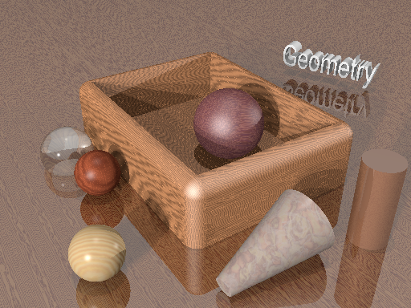

# 真实感静态景物

##### 16307130322 苏心怡

#### 使用工具介绍：

采用一款使用光线跟踪绘制三维图像的开放源代码自由软件[POV-Ray](http://www.povray.org/)。

采用[POV-Ray SDL](http://www.povray.org/documentation/view/3.6.0/224/) (Scene Description Language)，即这款软件使用的程序语言进行编程并渲染图形。

### 实验结果：

 

#### 程序说明：

1. 定义camera, 定位相机位置和角度（也即渲染结果的视角）

2. 定义几处光源对景物进行投影

3. 定义一块无限延展的平面作为地板， 定义球体，柱形， 圆锥形，和容器（Box）的形状， 位置，纹理

4. 这些球体的渲染材质有金属，木纹， 石头和玻璃

5. 添加一处立体字Geometry，即图片的标题

   

参考：

[POV-Ray Reference](http://www.povray.org/documentation/3.7.0/r3_0.html)

[POV-Ray 作品集](http://www.povray.org/resources/)

